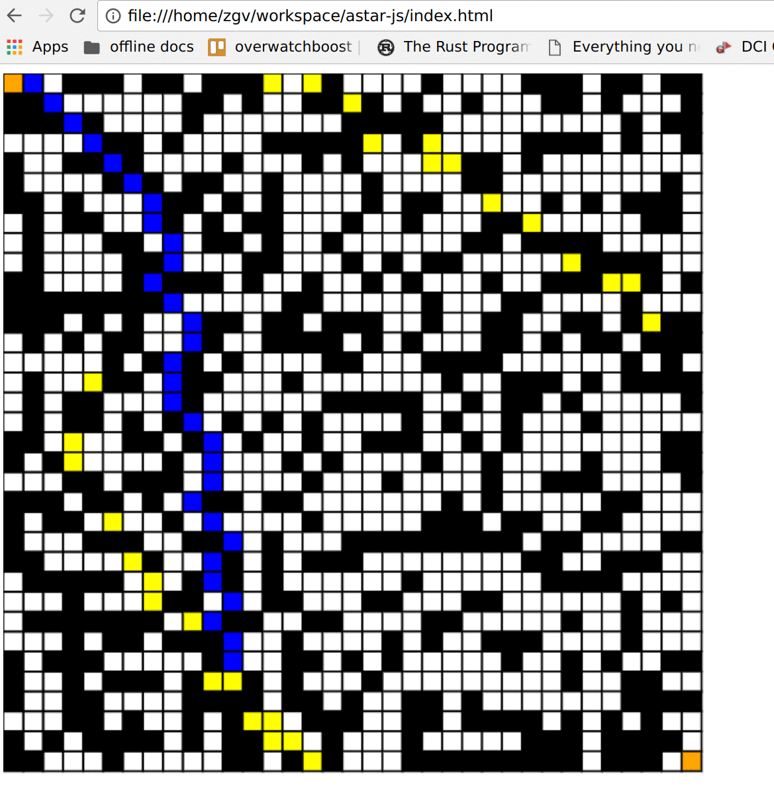

# Astar-JS | A* algorithm implementation
Simple and basic implementation of the A* algorithm.

The code is a bit messy, I just wanted to play with the algorithm a bit.



# Installation

Install dependencies
```
$ bower install
```

Open `index.html` in your browser.
